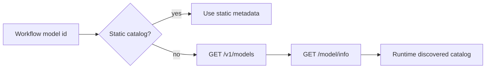

LiteLLM lets Fabro use one OpenAI-compatible endpoint for many upstream model providers.

## Setup

Set the proxy base URL. The API key is optional when the proxy accepts unauthenticated local traffic.

```bash
export LITELLM_BASE_URL=http://localhost:4000/v1
export LITELLM_API_KEY=sk-proxy-key
```

Use `provider = "litellm"` in `workflow.fabro` node attributes or `[run.model]` defaults:

```toml
[run.model]
provider = "litellm"
name = "anthropic/claude-sonnet-4"
```

## Auto Discovery

When Fabro sees an unknown model and LiteLLM is configured, it can query the proxy catalog and synthesize runtime metadata.

```toml
[llm.discovery]
enabled = true
persist = "session"
ttl_seconds = 3600
deny = ["gpt-*-preview"]
```



Useful overrides:

| Variable | Purpose |
| --- | --- |
| `FABRO_LLM_DISCOVERY=off\|session\|project` | Discovery persistence mode |
| `FABRO_LLM_DISCOVERY_TTL=3600` | Runtime metadata TTL |
| `FABRO_LLM_DISCOVERY_DENY="gpt-*-preview"` | Comma-separated deny patterns |
| `FABRO_LITELLM_MODELS_TTL=60` | `/models` cache TTL |

Persist project discoveries with:

```bash
fabro model discover anthropic/claude-sonnet-4
fabro model discover --all
fabro model list --discovered --source litellm
fabro model forget anthropic/claude-sonnet-4
```

## Virtual Keys

Prefer per-workflow or per-stage environment indirection instead of plaintext keys.

```toml
[llm.litellm]
api_key_env = "LITELLM_KEY_PROJECT_X"
```

Stage-level graph attributes can override the workflow key:

```dot
sensitive [
  provider="litellm",
  model="anthropic/claude-sonnet-4",
  litellm_api_key_env="LITELLM_KEY_SECURE"
]
```

Direct `api_key` values are accepted for local experiments but are logged as plaintext-risk warnings.

## Fallbacks

Use model fallbacks when a provider returns a transient error such as 429, 5xx, timeout, or context-length exceeded.

```toml
[run.model]
provider = "anthropic"
name = "claude-opus-4-7"
fallbacks = [
  "litellm/anthropic/claude-opus-4-7",
  "litellm/bedrock/anthropic.claude-3-5-sonnet-20241022-v2:0"
]
```

Fabro does not fallback on bad requests, missing auth, access denied, or intentional cancellation.

## Cost Tracking

For LiteLLM responses, Fabro reads these headers when present:

| Header | Recorded as |
| --- | --- |
| `x-litellm-model-id` | Upstream model |
| `x-litellm-cache-hit` | Cache hit |
| `x-litellm-response-cost` | USD cost |
| `x-litellm-fallbacks` | Upstream fallback chain |

These fields are attached to LLM usage metadata and appear in run event output when the stage records usage.

## Troubleshooting

| Symptom | Likely cause | Fix |
| --- | --- | --- |
| 401 | Proxy rejected the key | Check `LITELLM_API_KEY` or stage virtual key |
| 429 | Upstream rate limit | Add fallback models or reduce concurrency |
| Model not found | Proxy catalog does not expose the id | Run `fabro model discover --all` and verify `/v1/models` |
| Timeout | Proxy or upstream latency | Increase provider timeout or use a closer LiteLLM deployment |

## Migration

Move direct provider keys behind LiteLLM by configuring upstream providers in LiteLLM, then replace workflow provider values with `litellm` and use proxy model IDs such as `anthropic/claude-sonnet-4`. Keep direct Anthropic/OpenAI keys available during migration if you want Fabro fallback chains to bypass the proxy.
